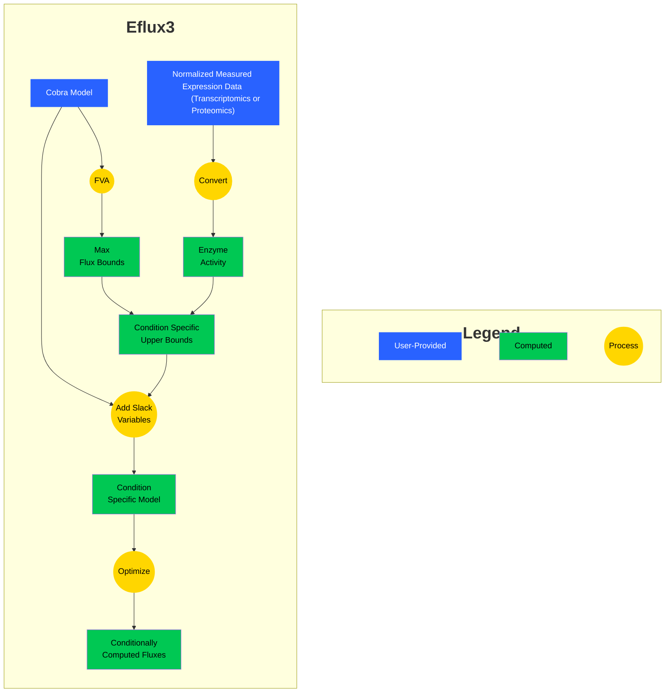

```mermaid
flowchart TD

classDef hidden display: none;

subgraph Legend[<h1> Legend </h1>]
 %% subgraph Legend["**Legend**"]
        A[" "]:::hidden
        UserData["User-Provided"]
        CompData["Computed"]
        Action(("Process"))
 end

 subgraph Eflux[<h1> Eflux3 </h1>]
        direction TB
        B[" "]:::hidden
        ExprData["Normalized Measured Expression Data 
            (Transcriptomics or Proteomics)"]
        Convert(("Convert"))
        EnzAct["Enzyme 
        Activity"]
        FVA(("FVA"))
        OrigCobra["Cobra Model"]
        FluxBounds["Max 
        Flux Bounds"]
        CondBounds["Condition Specific 
        Upper Bounds"]
        AddSlack(("Add Slack 
        Variables"))
        CondModel["Condition
         Specific Model"]
        Optimize(("Optimize"))
        CondCompFluxes["Conditionally 
        Computed Fluxes"]
 end

    %% Hidden links to create spacing
    A ~~~ UserData
    B ~~~ OrigCobra

    %% Legend Links (to enforce TD)
    UserData ~~~ CompData
    CompData ~~~ Action

    %% Get Enzyme Activity
    ExprData --> Convert --> EnzAct

    %% Get Max Flux Bounds
    OrigCobra --> FVA --> FluxBounds

    %% Get Conditioned Upper Bounds
    FluxBounds & EnzAct --> CondBounds

    %% Get Conditioned Model
    OrigCobra & CondBounds --> AddSlack --> CondModel

    %% Get Conditioned Fluxes
    CondModel --> Optimize --> CondCompFluxes

    %% Color styles for each node
    %% Raw Data - Blue
    style UserData stroke:#2962FF,fill:#2962FF,color:#FFFFFF
    style ExprData stroke:#2962FF,fill:#2962FF,color:#FFFFFF
    style OrigCobra stroke:#2962FF,fill:#2962FF,color:#FFFFFF

    %% Computed Data- Green
    style CompData fill:#00C853,color:#000000
    style EnzAct fill:#00C853,color:#000000
    style FluxBounds fill:#00C853,color:#000000
    style CondBounds fill:#00C853,color:#000000
    style CondModel fill:#00C853,color:#000000
    style CondCompFluxes fill:#00C853,color:#000000

    %% Process - Yellow
    style Action stroke:#FFD600,stroke-width:4px,stroke-dasharray: 0,fill:#FFD600,color:#000000
    style Convert stroke:#FFD600,stroke-width:4px,stroke-dasharray: 0,fill:#FFD600,color:#000000
    style FVA stroke:#FFD600,stroke-width:4px,stroke-dasharray: 0,fill:#FFD600,color:#000000
    style AddSlack fill:#FFD600,stroke:#FFD600,stroke-width:4px,stroke-dasharray: 0,color:#000000
    style Optimize fill:#FFD600,stroke:#FFD600,stroke-width:4px,stroke-dasharray: 0,color:#000000
```