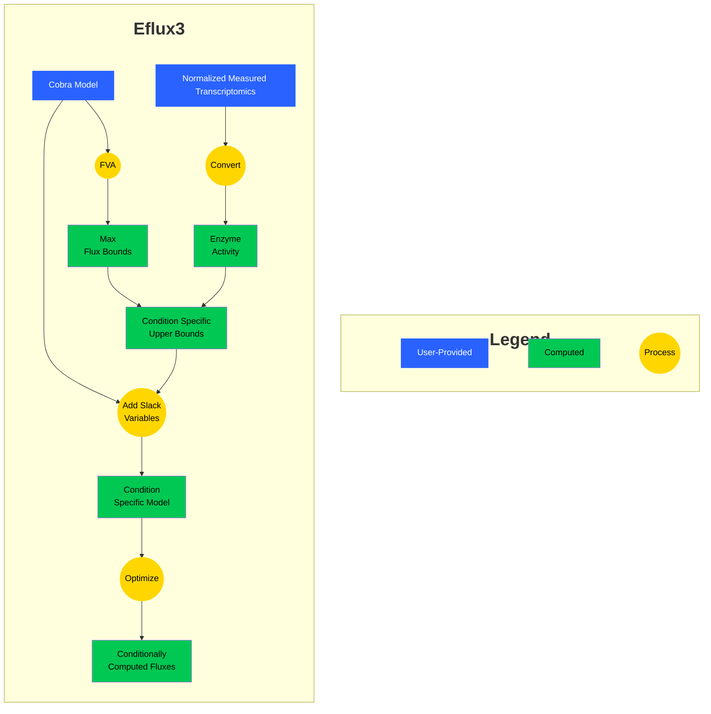

# E-Flux (combining Expression Data with Fluxes)

[](https://github.com/pnnl-predictive-phenomics/eflux/actions)
[](https://rye-up.com)
[](https://opensource.org/licenses/BSD-2-Clause)
[](https://github.com/astral-sh/ruff)

Package to run E-Flux on `cobra` models with provided transcriptomics expression data.
# eflux

A repository for hosting the code for E-flux.



## Getting Started 🏃

To get started run the following:

```python
from eflux import eflux2

eflux2(cobra_model, transcriptomics)
```

## Installation 🪛

The most recent code and data can be installed directly from GitHub with:

```shell
pip install git+https://github.com/pnnl-predictive-phenomics/eflux.git
```

## License 📄

The code in this package is licensed under the BSD-2 License.


## Contributing 👋
To contribute to this package, please reference [CONTRIBUTING.md](CONTRIBUTING.md)
